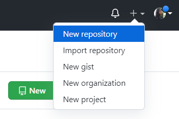
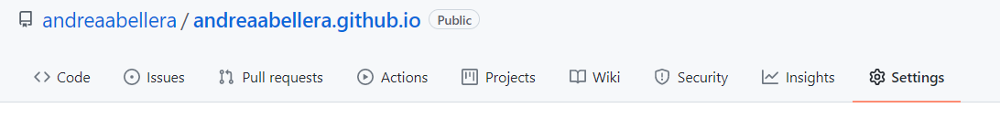
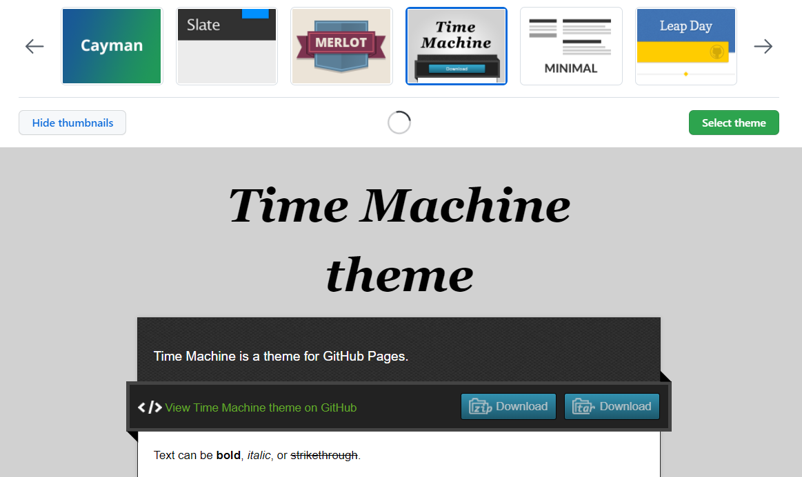
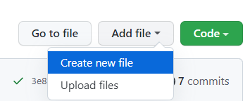
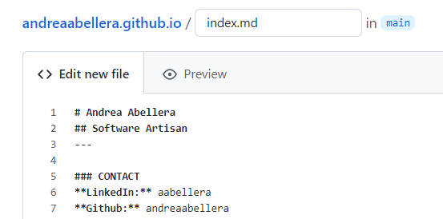
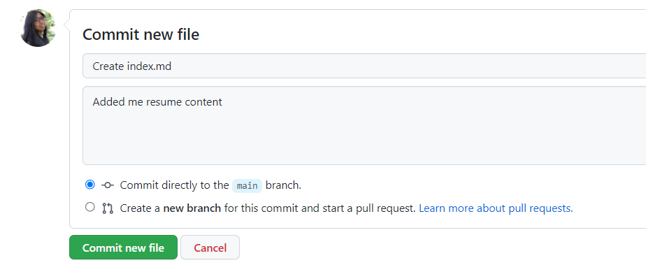
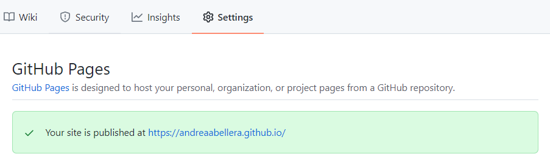

# Hosting Your Resume on Github Pages
Getting your resume online gives a double-edged advantage. It allows you to exhibit your technical qualifications and it also shows your documentation skills in action! This README will teach you how to host your resume online through a free site with Github Pages. In addition, this repository hosts a live resume as an example of a [site](https://andreaabellera.github.io/) that you can expect as an end result.

---
## Contents
- [Purpose](#Purpose)
- [Prerequisites](#Prerequisites)
- [Instructions](#Instructions)
  - [Making a Repository in Github](#Making-a-Repository-in-Github)
  - [Bringing your Site Live with Github Pages](#Bringing-your-Site-Live-with-Github-Pages)
  - [Adding a Site Template with Jekyll](#Adding-a-Site-Template-with-Jekyll)
  - [Modifying Site Content with Markdown](#Modifying-Site-Content-with-Markdown)
  - [Viewing your Github Pages Site](#Viewing-your-Github-Pages-Site)
- [Additional Resources](#Additional-Resources)
- [Author and Acknowledgements](#Author-and-Acknowledgement)
- [FAQ](#FAQ)

---
## Purpose
This README will teach you how to host your resume online through Github Pages. Andrew Etter suggests in his book, Modern Technical Writing, that documentation must be built and hosted in a website, not distributed as PDFs. Furthermore, the following shows the benefits of hosting your resume online based on Etter's principles.

### Why host a resume in Github Pages?
- Etter states that "even the best documentation, like software, eventually goes out of date." Integrating Git allows effective version control so that and eliminates the need of keeping multiple .pdf versions in a hard drive that take up space.
- You avail easy and convenient site updates facilitated by Github pages. Etter says that using static site generators "gives you the power to fix inaccuracies almost instantly and keep your content in sync."
- Your site can be used as a quick reference for employers and they will not need to download a file to view your qualifications. If you do not have your resume in file when the perfect opportunity comes by, this is easily remedied by sending your prospective employer or coworker your online resume link.
- Avail yourself the chance to display your technical writing prowess!

---
## Prerequisites
Before proceeding to the [Instructions](#Instructions) section to host your resume, you are required to possess or prepare the following items:

### A Resume
Ensure that your resume details are up-to-date, accurate, and free of grammatical errors.

### Markdown Familiarity
Complete a [Markdown tutorial](https://www.markdowntutorial.com/) to become familiar with Markdown syntax.

### A Markdown Editor
Find or acquire a Markdown editor that both displays your written Markdown syntax and converted text in parallel to streamline your workflow. A good, free online editor that you can use is [StackEdit](https://stackedit.io).

### A Github Account
Create a free Github account [here](https://github.com/signup).

---
## Instructions
### Making a Repository in Github
1. Click the '+' button on the top-right menu.
2. From the dropdown, select **New Repository**.  

3. Name your repository with _your-username_.github.io  

---
### Bringing your Site Live with Github Pages
1. Click on **Settings** from your repository's menu options.  

2. Head to the **Pages** section from the list of setting categories.
3. Select **main** as your branch under **Source** to enable Github Pages to build a site from your repository main branch.
4. Select **root** as your source folder.  

---
### Adding a Site Template with Jekyll
1. Click on **Choose a theme** under **Theme Chooser**.
2. Select a design theme of your choice.  

---
### Modifying Site Content with Markdown
1. Click **Add file** on the menu above your repository's file list.
2. From the dropdown, select **Create new file**.  

3. Re-write your resume in Markdown syntax on the editor provided.  

4. Save your changes through the commit section at the bottom of the page. This adds index.md into your repository.  

---
### Viewing your Github Pages Site 
1. There are three ways to your new Github Pages site:
  - Enter _your-username_.github.io into your browser's address bar.
  - Click on the Github Pages link provided in your repository's **Pages** setting.  
  
  - Click on the **github-pages** under the **Environments** section, located to the right of your repository file list.  
    - 1.3.1 Select the **View deployment** button beside your site's topmost build.
2. Voila! Your resume is now hosted in a live Github Pages site.  

---
## Resources
- [Markdown tutorial](https://www.markdowntutorial.com/)
- [Online Markdown Editor](https://stackedit.io)
- [Modern Technical Writing: An Introduction to Software Documentation](https://www.amazon.ca/Modern-Technical-Writing-Introduction-Documentation-ebook/dp/B01A2QL9SS) by Andrew Etter
- [Jekyll Setup Documentation](https://jekyllrb.com/docs/)

---
## Author and Acknowledgements
### Document Author
- [Andrea Abellera](www.github.com/andreaabellera)

### Live Site Template
- [Beautiful Jekyll](https://github.com/daattali/beautiful-jekyll/) by Dean Attali

### Peer Editing Group
- [Megan Galbraith](https://github.com/galbrame)
- [Andrii Provozin](https://github.com/developik)
- [Matthew Kwiatkowski](https://github.com/Speuce)
- Ian Tobinpe

---
## FAQ
### Why do we use Markdown but not HTML?
Though both options are widely-used markup languages which can render text for the web, Markdown is preferred for documentation due to its cleaner style and syntax. Markdown, unlike HTML, does not require opening and closing tags and eliminates the risk of neglecting or mispelling a tag which causes a page to render erroneously. Markdown is easier to learn and more readable. Moreover, it allows the author to focus more on creating and modifying documentation content with minimal concern on page layout.

### Why is my resume not showing up?
The following may be reasons why Github pages fails to show up or load correctly in your browser:
- The site is being built from the wrong source. Ensure that your Jekyll and resume file are in the build folder that is set up in your repository's **Pages** setting.
- The Jekyll homepage, index.md, is either named incorrectly or is an empty file.
- Clear your browser cache if site changes are not being reflected properly.